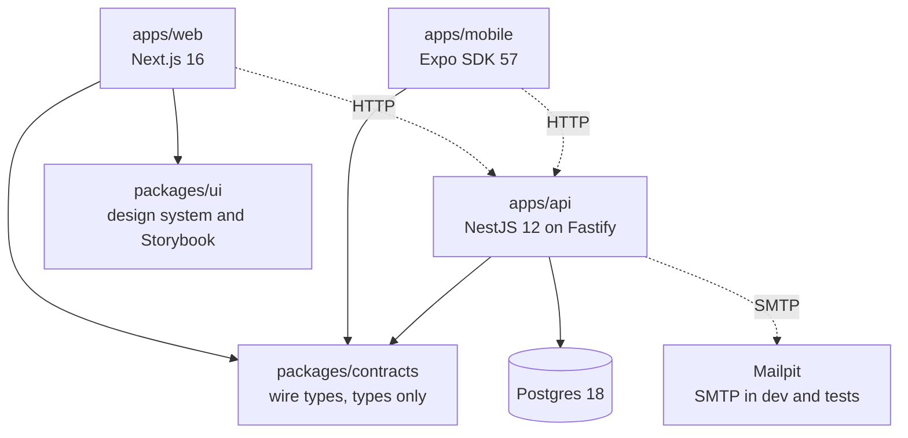
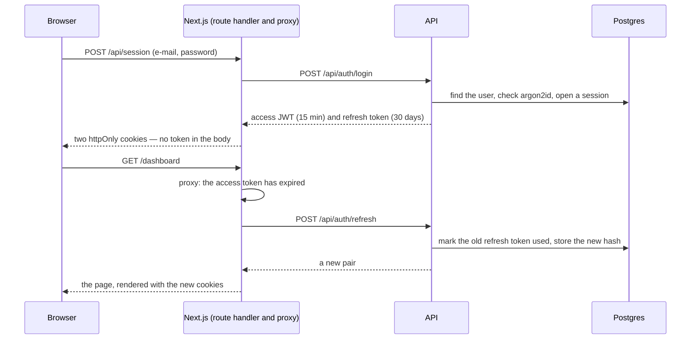

# harness-monorepo

A full-stack monorepo template — **Next.js**, **NestJS** and **Expo** — wired with an **AI harness**: a written contract every coding agent reads, documentation organised so an agent finds what it needs, and gates that turn the rules into build failures instead of review comments.

On top of it, an **auth starter** is being built: accounts with e-mail verification, sessions that refresh without ever showing a token to page JavaScript, password reset, and a design system with Storybook — the first thing any product started from this template needs.

**Quick links**, [Status](#status) · [Getting started](#getting-started) · [Architecture](#architecture) · [How a session works](#how-a-session-works) · [The harness](#the-harness-in-one-minute) · [Verification](#verification)

---

## Status

The auth starter is ticket AUTH-1. Its Definition of Done, decisions and commit order: [the plan](docs/plans/2026-09-10--AUTH-1--auth-starter.md).

| Piece | State | Where |
|---|---|---|
| Wire types for accounts and sessions | done | [packages/contracts/src/auth.ts](packages/contracts/src/auth.ts) |
| Account rules — verification, sessions, reset, no account enumeration | done | [docs/product](docs/product/README.md) |
| Postgres 18 and Mailpit, one command | done | [docker-compose.yml](docker-compose.yml) |
| Gates for the design system, and for session state in web storage | done | [scripts/arch-gates.sh](scripts/arch-gates.sh) |
| Design-system workspace and its contract | done | [packages/ui/AGENTS.md](packages/ui/AGENTS.md) |
| Dependencies, Prisma 7 schema and first migration | done | [apps/api/prisma](apps/api/prisma/schema.prisma) |
| API — register, verify, log in, refresh, log out, forgot and reset password, `/users/me`, Swagger, rate limits | done | [apps/api/docs](apps/api/docs/README.md) |
| Design system — tokens, shadcn primitives, auth and dashboard blocks, Storybook | done | [packages/ui/docs](packages/ui/docs/README.md) |
| Web — auth screens, dashboard, httpOnly session, proxy, pt-BR and English | done | [apps/web/docs](apps/web/docs/README.md) |
| Tests — API unit and e2e against Postgres and Mailpit, components with axe, one Playwright journey | next | |

This table moves as the work lands. The plan is the fixed record of what was decided and why.

## Getting started

Needs Node 22 or newer (CI uses the version in `.nvmrc`), pnpm 10 and Docker.

```bash
pnpm install
cp apps/api/.env.example apps/api/.env
pnpm stack:up          # Postgres on :5432 · Mailpit on :1025 (SMTP) and :8025 (inbox)
pnpm db:migrate        # create the schema
pnpm dev               # web :3000 · api :3001
```

| Service | URL |
|---|---|
| Web | http://localhost:3000 |
| API | http://localhost:3001/api |
| API documentation (Swagger) | http://localhost:3001/api/docs |
| Mailpit — every e-mail the API sends | http://localhost:8025 |
| Postgres | localhost:5432 |

Mobile: `pnpm dev:mobile`, then open it in Expo Go. Over-the-air updates need a one-time `eas init` — see [apps/mobile/docs/release-ota.md](apps/mobile/docs/release-ota.md).

### Commands

| Command | What it does |
|---|---|
| `pnpm dev` | every app in watch mode |
| `pnpm stack:up` / `pnpm stack:down` | Postgres and Mailpit in containers |
| `pnpm db:migrate` | applies the Prisma migrations to the development database |
| `pnpm test` | unit and component tests, no Docker needed |
| `pnpm ci-check` | the local mirror of CI — run before "done" |
| `pnpm arch-gates` · `pnpm docs-gate` | the harness's own gates, in seconds |

## Architecture



`packages/contracts` is the one package all three apps import, and it holds types only. A field renamed there fails the build of the API and of both apps in the same run — which is the point of keeping them in one repository.

`packages/ui` has no edge from mobile, and a gate keeps it that way: `mobile/no-web-imports` fails the commit that imports it. What mobile will share with the web is the contract, not components.

## How a session works

This is the design AUTH-1 is building; the plan records why each piece is shaped this way.



**Tokens never reach page JavaScript.** Next's route handlers hold both tokens in `httpOnly` cookies. A script injected into the page can make requests, but it cannot read a token and carry it elsewhere.

**A refresh token works once.** Refreshing marks the token used and hands out a new one. A used token presented again means it was copied, so every token of that session is revoked at once.

**The proxy redirects; the API decides.** `src/proxy.ts` looks only for a session cookie, to send a signed-out visitor to `/login` before the page renders. The API checks the bearer token on every request.

**No account enumeration.** A wrong password reads the same as an unknown e-mail, and "forgot password" answers the same way for any address.

## The harness in one minute

1. **One contract.** [AGENTS.md](AGENTS.md) is read by Claude Code, Cursor, Codex and Copilot alike; `CLAUDE.md` only imports it. Each workspace adds a short delta of what is true *there*.
2. **A place for every fact.** Docs live in four tiers — product, repo, rules, plans — each decided by one question. A fact that belongs to one app lives inside that app, and dies with it.
3. **Rules become gates.** [scripts/arch-gates.sh](scripts/arch-gates.sh) greps for what a type-checker cannot express; [scripts/docs-gate.sh](scripts/docs-gate.sh) keeps the docs themselves honest. Both run on every commit.
4. **Skills are the workflows.** [.claude/skills/](.claude/skills/implement-task/SKILL.md) holds how a task is implemented and delivered — and, most important, how a review lesson is **routed** to the one tier where it belongs, so the contract never grows into an encyclopedia.

The full design, and how to tell whether it is working: [docs/repo/harness.md](docs/repo/harness.md).

## Verification

```bash
pnpm ci-check   # type-check · lint · test · expo-doctor · arch-gates · docs-gate
```

CI runs the same checks, and `pre-push` runs them for you.
