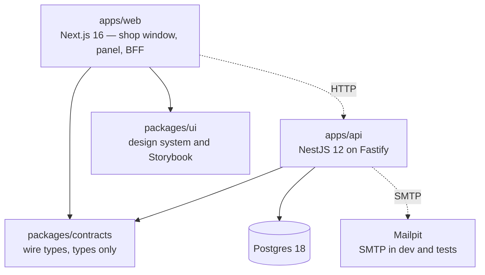
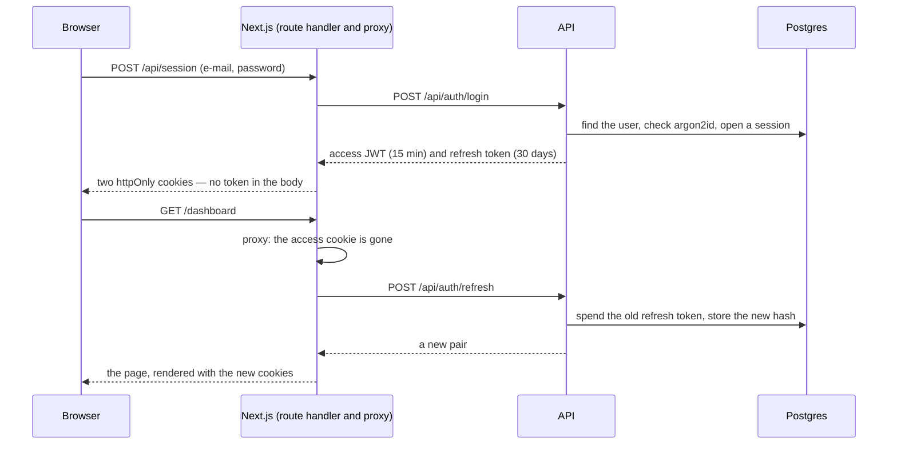

# bee-link

A multi-tenant **storefront and orders SaaS**. Every shopkeeper gets a public shop window at `/<slug>` and a panel at `/admin/<slug>`: they load a catalogue, customers fill a cart and check out, the order lands in the panel, and the conversation carries on in WhatsApp. No marketplace, no payment processing — bee-link never stands between a shopkeeper and their customer.

[](https://github.com/rafaelsrabelo/beelink-monorepo/actions/workflows/ci.yml)

**Quick links**, [What bee-link is](#what-bee-link-is) · [Where it stands today](#where-it-stands-today) · [Getting started](#getting-started) · [Architecture](#architecture) · [Design system](#design-system) · [The AI harness](#the-ai-harness) · [Built on a template](#built-on-a-template)

---

## What bee-link is

A **store** is the tenant, and its slug is its public address. Everything else — products, categories, orders, customers, delivery rules, coupons — belongs to exactly one store and is meaningless outside it. Two shopkeepers are strangers to each other.

The full product definition, written so it survives every app being rewritten: [docs/product/README.md](docs/product/README.md).

| Workspace | What |
|---|---|
| [`apps/web`](apps/web/AGENTS.md) | the browser surface — the shop window, the panel, and the BFF route handlers between them and the API |
| [`apps/api`](apps/api/AGENTS.md) | the backend — NestJS 12 on Fastify, Prisma over Postgres, Swagger at `/api/docs` |
| [`packages/contracts`](packages/contracts/AGENTS.md) | the wire types, shared by both. Types only, so a renamed field fails both builds in one run |
| [`packages/ui`](packages/ui/AGENTS.md) | the design system — tokens, shadcn primitives, presentational blocks, Storybook |

## Where it stands today

bee-link runs in production as a Next.js monolith on Supabase, in a separate repository. **This repository is its replacement, being built one domain at a time** — stores, then the catalogue, then the shop window, then delivery, orders, promotions. The legacy app stays live throughout, and stores are cut over one at a time. The plan, including why it is a rewrite by domain rather than a lift-and-shift, is in [docs/plans/](docs/plans/README.md).

What is here now is the **foundation, not the product**:

- **Accounts, end to end.** Sign up, confirm by e-mail, sign in, stay signed in, sign out, forget and reset a password — ten API routes, all documented in Swagger with a working Authorize button. The shopkeeper's account is this account; there is no second notion of a user waiting to be invented.
- **Sessions that survive a closed laptop and die the moment they should.** A 15-minute access token plus a rotating refresh token. Signing out or resetting a password cuts every device off at once, not when the token happens to expire.
- **Tokens the page cannot read.** Both live in `httpOnly` cookies (`bl_access`, `bl_refresh`) written by Next route handlers. A browser test asserts that `document.cookie`, `localStorage` and `sessionStorage` hold nothing.
- **Reuse detection with room for real browsers.** A spent refresh token presented again revokes the whole session — unless it comes back within 20 seconds, which is two tabs racing rather than theft.
- **Nothing leaks who has an account.** A wrong password reads exactly like an unknown e-mail, down to the response time, and "forgot password" answers the same for any address.
- **The shop window's read path, already in place and not yet called.** `src/lib/public-api.ts` and `src/lib/revalidate.ts` are the cached, anonymous half of the app: catalogue reads tagged `store:<slug>` and `catalog:<slug>`, and one place that invalidates them. The route group that uses them arrives with the phase that builds it.
- **A proxy matcher that is an allow-list.** `src/proxy.ts` names the signed-in paths; everything it does not name is public. That is what will let `/<slug>` be served to a crawler instead of redirected.
- **A design system in its own package.** 23 shadcn primitives and 9 presentational blocks, every block with a story and a test that includes an accessibility check.

What is **not** here yet: no `/<slug>`, no `/admin/<slug>`, no products, orders or customers. The screens that exist are the harness's own — the auth flow and a dashboard whose numbers are still sample data.

## The result

Signing in, and the same screen refusing what the API refused:


The dashboard, in light and dark — the same components, a different set of token values:


The same session, read in English. Nothing about the session changes; only the dictionary does — pt-BR is what the product ships and what an unrecognised browser gets, and the switcher is owner-facing chrome:


Creating an account, and confirming it from the link in the e-mail:


Every image above is taken from the running application by `pnpm screenshots`, so they cannot drift from what the app looks like.

## Getting started

Needs Node 22 or newer (CI uses the version in `.nvmrc`), pnpm 10 and Docker.

```bash
pnpm install
cp apps/api/.env.example apps/api/.env
pnpm stack:up
pnpm db:migrate
pnpm dev
```

`stack:up` starts Postgres and Mailpit, `db:migrate` creates the schema, and `dev` runs both apps in watch mode.

Then open http://localhost:3000, create an account, and read the confirmation e-mail at http://localhost:8025. Nothing leaves the machine.

| Service | URL |
|---|---|
| Web | http://localhost:3000 |
| API | http://localhost:3001/api |
| API documentation (Swagger) | http://localhost:3001/api/docs |
| Mailpit — every e-mail the API sends | http://localhost:8025 |
| Storybook | http://localhost:6006 (`pnpm storybook`) |
| Postgres | localhost:5432 |

### Commands

| Command | What it does |
|---|---|
| `pnpm dev` | every app in watch mode |
| `pnpm stack:up` · `pnpm stack:down` | Postgres and Mailpit in containers |
| `pnpm db:migrate` | applies the Prisma migrations to the development database |
| `pnpm test` | unit and component tests, no Docker needed |
| `pnpm test:e2e` | the suites that need Postgres and Mailpit |
| `pnpm storybook` | the design system, with a light/dark toggle and the a11y panel |
| `pnpm screenshots` | retakes the images in this README from the running app |
| `pnpm ci-check` | the local mirror of CI — run before "done" |
| `pnpm ci-check --e2e` | the same, plus everything that needs Docker |
| `pnpm arch-gates` · `pnpm docs-gate` | the harness's own gates, in seconds |

## What is proved, and where

| Claim | Where it lives | What covers it |
|---|---|---|
| Sign up with e-mail confirmation | [auth.service.ts](apps/api/src/modules/auth/auth.service.ts) | e2e tests against a real inbox |
| Sign in, refresh, sign out | [session.service.ts](apps/api/src/modules/auth/session.service.ts) | e2e tests, one per branch of the rotation |
| Password reset that ends every session | [auth.service.ts](apps/api/src/modules/auth/auth.service.ts) | e2e, plus a browser test that replays the old cookies |
| Every route closed by default | [jwt-auth.guard.ts](apps/api/src/modules/auth/jwt-auth.guard.ts) | unit tests + e2e |
| Rate limiting with one error shape | [app.setup.ts](apps/api/src/app.setup.ts) | e2e, including the 429 body |
| Passwords and tokens never stored in the clear | [auth.prisma](apps/api/prisma/schema/auth.prisma) · [auth.tokens.ts](apps/api/src/modules/auth/auth.tokens.ts) | unit tests + the schema itself |
| Swagger with bearer auth | [setup-swagger.ts](apps/api/src/shared/swagger/setup-swagger.ts) | `/api/docs`, 10 documented routes |
| Tokens out of reach of page JavaScript | [session-cookies.ts](apps/web/src/lib/session-cookies.ts) | route-handler tests + a browser assertion |
| Optimistic redirects and token refresh | [proxy.ts](apps/web/src/proxy.ts) | one test per branch, including the allow-list matcher |
| Screens in the reader's language | [locales/](apps/web/src/locales) · [ui locales](packages/ui/src/locales) | dictionary tests + a browser journey in English |
| Design system with stories | [packages/ui](packages/ui/AGENTS.md) | component tests, each with axe |
| Accessibility | every block and page | axe in jsdom for components, axe in a real browser for pages |

`pnpm test` and `pnpm ci-check --e2e` print the counts; they are not repeated here, because a number in a README is the first thing to go stale.

## Architecture



`packages/contracts` is the one package both apps import, and it holds types only. A field renamed there fails the build of the API and of the web app in the same run — which is the point of keeping them in one repository.

### Three lanes reach the API

The shop window, the checkout and the panel do not ask the same way, and which lane applies is decided by **who is asking**:

| Who | How | Why |
|---|---|---|
| The shop window, on the server | a Server Component calling `src/lib/public-api.ts` with `revalidate` and cache tags | anonymous, holds no token, and needs HTML a crawler can read |
| The browser, at checkout | a BFF route handler under `src/app/api/`, forwarding the visitor's address | order creation is the most abusable endpoint in the product, and the API's per-IP rate limit is its guard |
| The panel | TanStack Query → BFF route handler → NestJS | the session token stays in an `httpOnly` cookie the page cannot read |

### How a session works



**The proxy redirects; the API decides.** `src/proxy.ts` looks only at whether a cookie is there, so a signed-out visitor lands on `/login` before a page renders. The API validates the bearer token — and the session behind it — on every call, and who owns a store is decided there, never in the proxy.

**Refreshing belongs to the proxy alone.** It is the only place that can store the successor. A Server Component that refreshed would spend the token with nowhere to put the new one, and the next request would look like theft.

**An outage is not a sign-out.** The refresh call tells three outcomes apart — renewed, rejected, and the API being unreachable — and only the second one clears the cookies.

## Design system

`packages/ui` is where every pixel a shopkeeper or a customer sees is drawn. `apps/web` wires those blocks to data; it does not style them.

**Presentational only.** Nothing there fetches, routes or reads a session: data, callbacks and links arrive through props. That is what makes every block render in Storybook with no server behind it, and it is enforced by the same gate that bans `fetch` in components.

**Blocks own their shape validation, screens own the server's answer.** A form block checks that the e-mail looks like one and the password is long enough, then hands valid values to `onSubmit`. Whether the account exists is the API's business, and it comes back as a sentence the screen already translated.

**Links are injected.** A block that navigates takes a `linkComponent`, `<a>` by default; the web passes `next/link`. An accessibility test caught the first version dropping every prop the primitives inject — including `aria-current`.

**No sentence lives in a component.** One interface describes every string, and each language implements it, so a missing key is a compile error. The validation messages travel with it: the same block says "Informe um e-mail válido" or "Enter a valid e-mail address" with nothing changed but the dictionary.

**Colours are tokens — and a store's brand is data.** A hex literal in a component fails `web/no-hex-colors` with no exceptions. The one legitimate per-store colour comes from the database and is applied at runtime as a CSS custom property, which is a value rather than a literal, so the gate stays absolute.

**Accessibility is a test, not a promise.** Every component test runs axe in jsdom; every page runs axe in a real browser, where colour contrast can actually be measured. That second check found a real failure — a footer at 4.34:1 against the 4.5:1 WCAG AA asks for.

**Motion is a preference.** The chart honours `prefers-reduced-motion`, which is also what makes the screenshots above deterministic.

## The AI harness

This repository is worked on mostly by coding agents, and it is built so that the rules are executable rather than hoped for.

1. **One contract.** [AGENTS.md](AGENTS.md) is read by Claude Code, Cursor, Codex and Copilot alike; `CLAUDE.md` only imports it. Each workspace adds a short delta of what is true *there*.
2. **A place for every fact.** Docs live in four tiers — product, repo, rules, plans — each decided by one question. A fact that belongs to one app lives inside that app, and dies with it.
3. **Rules become gates.** [scripts/arch-gates.sh](scripts/arch-gates.sh) greps for the structural rules a type-checker cannot express; [scripts/docs-gate.sh](scripts/docs-gate.sh) keeps the documentation itself honest. Both run on every commit.
4. **Decisions are written down once.** [docs/plans/](docs/plans/README.md) records why each piece is shaped the way it is, including the corrections made along the way — plans are append-only, so they stay a record rather than a rewrite.
5. **No baselines.** A gate that tolerates today's violations stops meaning anything. That is the reason the legacy app is being rewritten domain by domain instead of copied in: copied code would arrive with a baseline, and a baseline never goes back down.

The full design, and how to tell whether it is working: [docs/repo/harness.md](docs/repo/harness.md).

## Built on a template

This repository was cloned from **harness-monorepo**, a reusable template, which stays wired up as a second git remote:

```bash
git remote -v
# origin    git@github.com:rafaelsrabelo/beelink-monorepo.git   ← bee-link, this product
# template  git@github.com:rafaelsrabelo/harness-monorepo.git   ← the harness it grew from

git fetch template && git merge template/main
```

Improvements to the harness — a new gate, a sharper rule, a dependency bump — are made there and merged down here. Product decisions are made here and never pushed back up. That direction is what keeps the template reusable by the next project.

It is also why the root package and the shared packages are still named `harness-monorepo`, and why the web workspace is still called `web` rather than `bee-link`. Those names are load-bearing for turbo filters, CI jobs, the Playwright config and every document here, and renaming them would make every future merge from `template` a conflict for nothing the product can see. `apps/web` **is** the bee-link web app.

## Verification

```bash
pnpm ci-check
pnpm ci-check --e2e
```

The first runs type-check, lint, tests and both gates. `--e2e` adds the suites that need Postgres, Mailpit and a browser.

CI runs the same checks per workspace touched, and `pre-push` runs the Docker-free half for you.
