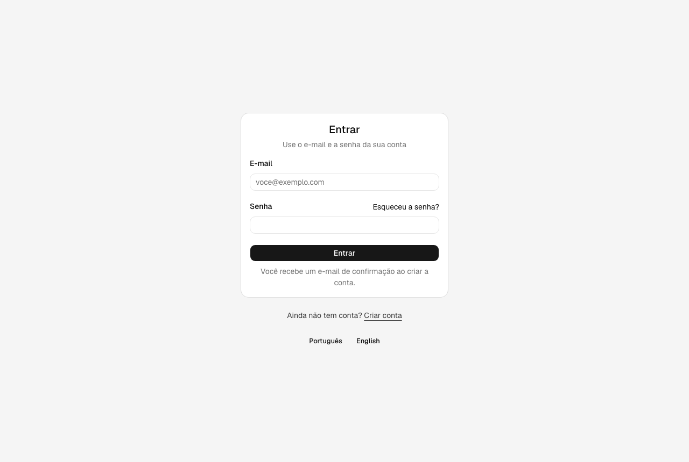
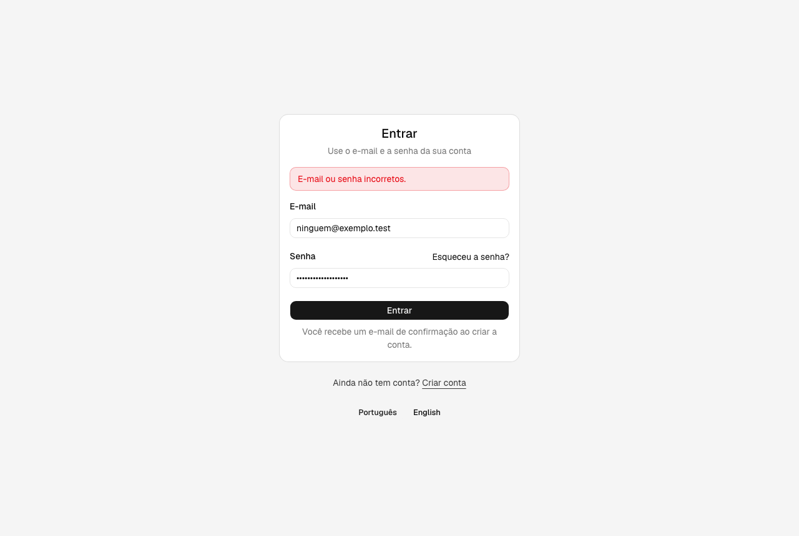
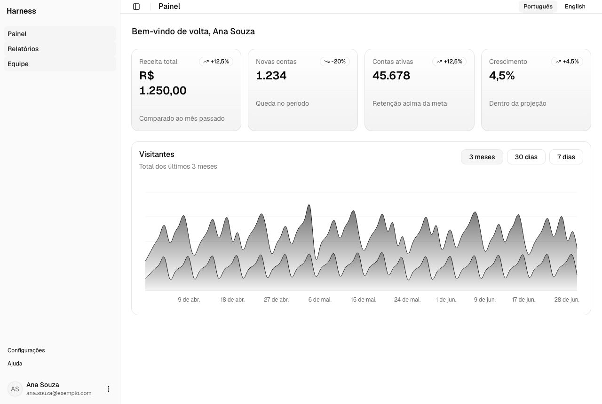
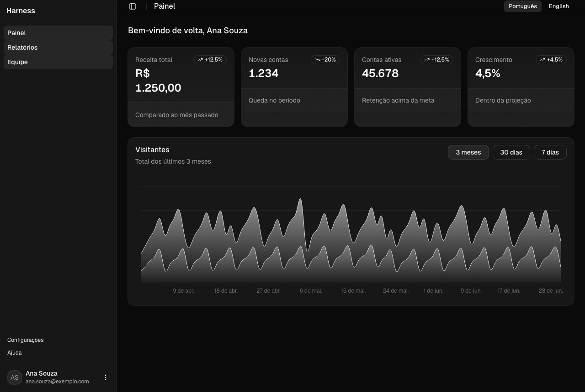
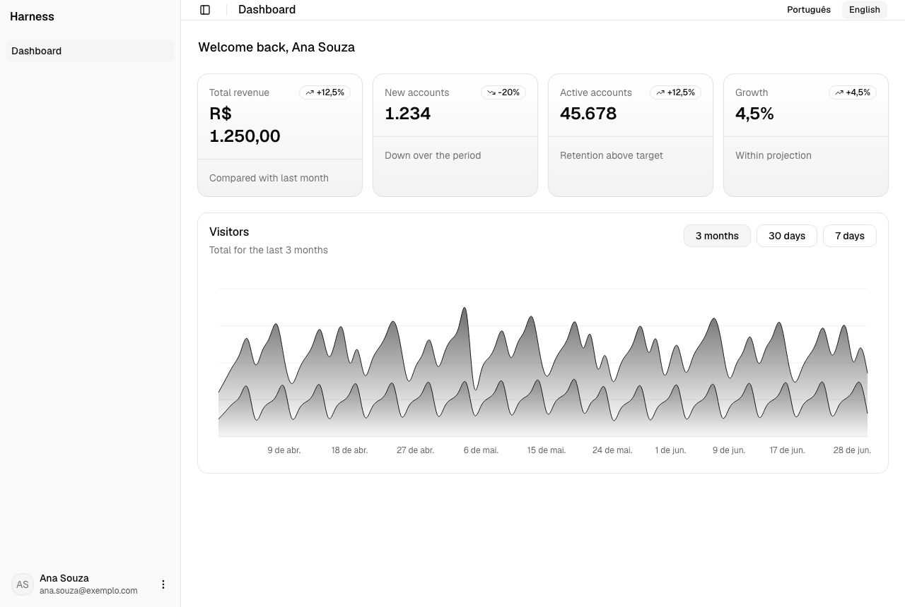
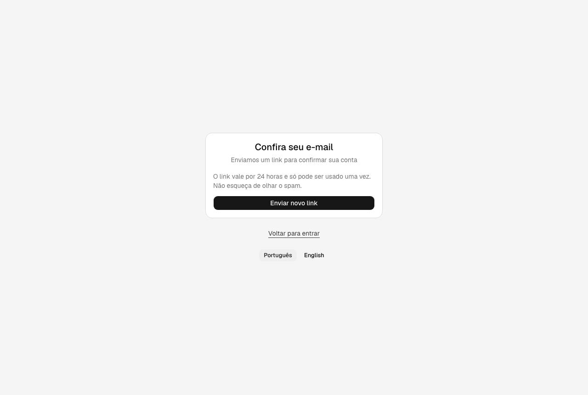
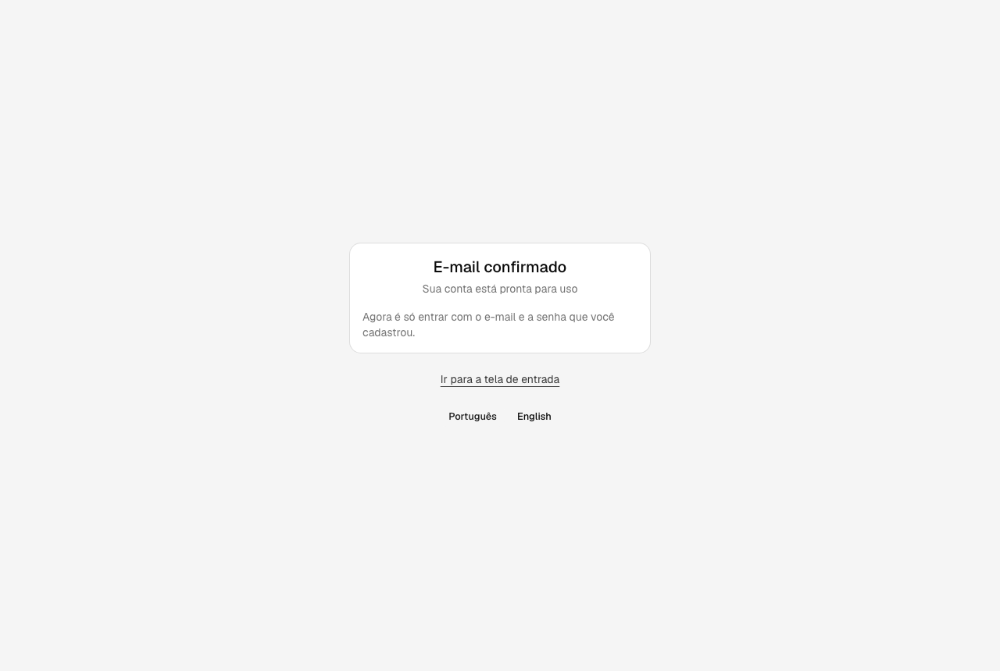
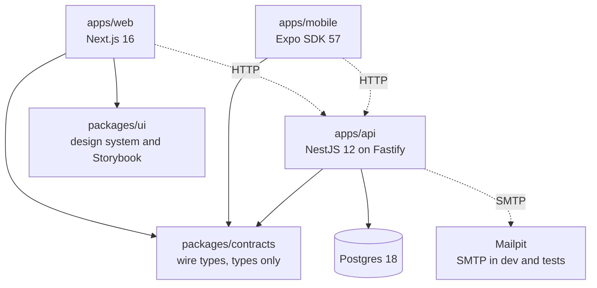
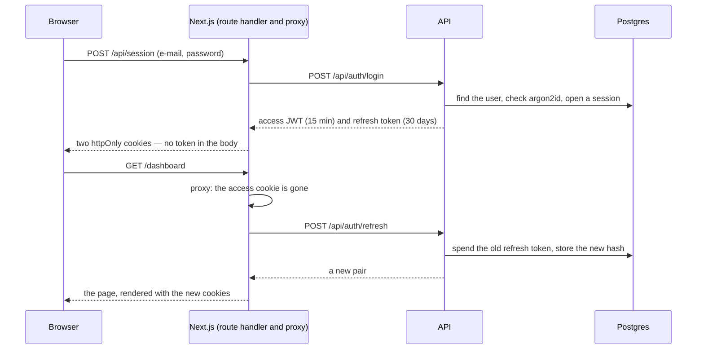

# harness-monorepo

A full-stack monorepo — **Next.js**, **NestJS** and **Expo** — with authentication working end to end, a design system in its own package, and an **AI harness** around it: one contract every coding agent reads, documentation organised so an agent finds what it needs, and gates that turn the rules into build failures instead of review comments.

[](https://github.com/rafaelsrabelo/harness-monorepo/actions/workflows/ci.yml)

**Quick links**, [What is delivered](#what-is-delivered) · [The result](#the-result) · [Getting started](#getting-started) · [Requirements checklist](#requirements-checklist) · [Architecture](#architecture) · [Design system](#design-system) · [The AI harness](#the-ai-harness) · [What I would do differently](#what-i-would-do-differently)

---

## What is delivered

- **Accounts, end to end.** Sign up, confirm by e-mail, sign in, stay signed in, sign out, forget and reset a password — ten API routes, all documented in Swagger with a working Authorize button.
- **Sessions that survive a closed laptop and die the moment they should.** A 15-minute access token plus a rotating refresh token. Signing out or resetting a password cuts every device off at once, not when the token happens to expire.
- **Tokens the page cannot read.** Both live in `httpOnly` cookies written by Next route handlers. A browser test asserts that `document.cookie`, `localStorage` and `sessionStorage` hold nothing.
- **Reuse detection with room for real browsers.** A spent refresh token presented again revokes the whole session — unless it comes back within 20 seconds, which is two tabs racing rather than theft.
- **Nothing leaks who has an account.** A wrong password reads exactly like an unknown e-mail, down to the response time, and "forgot password" answers the same for any address.
- **Two languages, no framework.** Brazilian Portuguese and English, each a file behind one interface, chosen by cookie and then by `Accept-Language`. The API only ever sends a stable `errorCode`; the apps own the words.
- **A design system in its own package.** 23 shadcn primitives and 9 presentational blocks, every block with a story and a test that includes an accessibility check.
- **102 automated tests**, a real Postgres and a real mail server in the loop, and a browser journey that reads the confirmation link out of the inbox the way a person would.

## The result

Signing in, and the same screen refusing what the API refused:





The dashboard, in light and dark — the same components, a different set of token values:





The same session, read in English. Nothing about the session changes; only the dictionary does:



Creating an account, and confirming it from the link in the e-mail:





Every image above is taken from the running application by `pnpm screenshots`, so they cannot drift from what the app looks like.

## Scope calibration

The brief was "an auth starter, like this design system repository, with the screens and the API". That is a small amount of behaviour, and a single folder of components would satisfy it.

The structure exists for four reasons stated around the brief rather than inside it: an auth starter is copied into real products, so its security decisions have to hold up; the repository is a template for AI agents, so every rule needs a gate rather than a paragraph; the design system is meant to be defensible on its own, so it lives in a package with its own Storybook and tests; and the product speaks two languages, so no sentence may be written inside a component.

[What I would do differently](#what-i-would-do-differently) names the places where I would trade this away.

## Getting started

Needs Node 22 or newer (CI uses the version in `.nvmrc`), pnpm 10 and Docker.

```bash
pnpm install
cp apps/api/.env.example apps/api/.env
pnpm stack:up
pnpm db:migrate
pnpm dev
```

`stack:up` starts Postgres and Mailpit, `db:migrate` creates the schema, and `dev` runs both apps in watch mode.

Then open http://localhost:3000, create an account, and read the confirmation e-mail at http://localhost:8025. Nothing leaves the machine.

| Service | URL |
|---|---|
| Web | http://localhost:3000 |
| API | http://localhost:3001/api |
| API documentation (Swagger) | http://localhost:3001/api/docs |
| Mailpit — every e-mail the API sends | http://localhost:8025 |
| Storybook | http://localhost:6006 (`pnpm storybook`) |
| Postgres | localhost:5432 |

Mobile: `pnpm dev:mobile`, then open it in Expo Go. Over-the-air updates need a one-time `eas init` — see [apps/mobile/docs/release-ota.md](apps/mobile/docs/release-ota.md).

### Commands

| Command | What it does |
|---|---|
| `pnpm dev` | every app in watch mode |
| `pnpm stack:up` · `pnpm stack:down` | Postgres and Mailpit in containers |
| `pnpm db:migrate` | applies the Prisma migrations to the development database |
| `pnpm test` | unit and component tests, no Docker needed |
| `pnpm test:e2e` | the suites that need Postgres and Mailpit |
| `pnpm storybook` | the design system, with a light/dark toggle and the a11y panel |
| `pnpm screenshots` | retakes the images in this README from the running app |
| `pnpm ci-check` | the local mirror of CI — run before "done" |
| `pnpm ci-check --e2e` | the same, plus everything that needs Docker |
| `pnpm arch-gates` · `pnpm docs-gate` | the harness's own gates, in seconds |

## Requirements checklist

| Requirement | Where it lives | What covers it |
|---|---|---|
| Sign up with e-mail confirmation | [auth.service.ts](apps/api/src/modules/auth/auth.service.ts) | 6 e2e tests against a real inbox |
| Sign in, refresh, sign out | [session.service.ts](apps/api/src/modules/auth/session.service.ts) | 10 e2e tests |
| Password reset that ends every session | [auth.service.ts](apps/api/src/modules/auth/auth.service.ts) | e2e, plus a browser test that replays the old cookies |
| Every route closed by default | [jwt-auth.guard.ts](apps/api/src/modules/auth/jwt-auth.guard.ts) | 6 unit tests + e2e |
| Rate limiting with one error shape | [app.setup.ts](apps/api/src/app.setup.ts) | 2 e2e tests, including the 429 body |
| Passwords and tokens never stored in the clear | [schema.prisma](apps/api/prisma/schema.prisma) · [auth.tokens.ts](apps/api/src/modules/auth/auth.tokens.ts) | 3 unit tests + the schema itself |
| Swagger with bearer auth | [setup-swagger.ts](apps/api/src/shared/swagger/setup-swagger.ts) | `/api/docs`, 10 documented routes |
| Tokens out of reach of page JavaScript | [session-cookies.ts](apps/web/src/lib/session-cookies.ts) | route-handler tests + a browser assertion |
| Optimistic redirects and token refresh | [proxy.ts](apps/web/src/proxy.ts) | 7 tests, one per branch |
| Screens in two languages | [locales/](apps/web/src/locales) · [ui locales](packages/ui/src/locales) | dictionary tests + a browser test in English |
| Design system with stories | [packages/ui](packages/ui/AGENTS.md) | 31 component tests, each with axe |
| Accessibility | every block and page | axe in jsdom for components, axe in a real browser for pages |

Totals: **95 Vitest tests** (17 API unit · 19 API e2e · 31 component · 28 web) and **7 Playwright tests** (3 journeys · 4 accessibility sweeps).

## Architecture



`packages/contracts` is the one package all three apps import, and it holds types only. A field renamed there fails the build of the API and of both apps in the same run — which is the point of keeping them in one repository.

`packages/ui` has no edge from mobile, and a gate keeps it that way: `mobile/no-web-imports` fails the commit that imports it. What mobile shares with the web is the contract, not components.

### How a session works



**The proxy redirects; the API decides.** `src/proxy.ts` looks only at whether a cookie is there, so a signed-out visitor lands on `/login` before a page renders. The API validates the bearer token — and the session behind it — on every call.

**Refreshing belongs to the proxy alone.** It is the only place that can store the successor. A Server Component that refreshed would spend the token with nowhere to put the new one, and the next request would look like theft.

**An outage is not a sign-out.** The refresh call tells three outcomes apart — renewed, rejected, and the API being unreachable — and only the second one clears the cookies.

## Design system

`packages/ui` is the part I would defend the longest, so it gets the most structure.

**Presentational only.** Nothing there fetches, routes or reads a session: data, callbacks and links arrive through props. That is what makes every block render in Storybook with no server behind it, and it is enforced by the same gate that bans `fetch` in components.

**Blocks own their shape validation, screens own the server's answer.** A form block checks that the e-mail looks like one and the password is long enough, then hands valid values to `onSubmit`. Whether the account exists is the API's business, and it comes back as a sentence the screen already translated.

**Links are injected.** A block that navigates takes a `linkComponent`, `<a>` by default; the web passes `next/link`. An accessibility test caught the first version dropping every prop the primitives inject — including `aria-current`.

**No sentence lives in a component.** One interface describes every string, and each language implements it, so a missing key is a compile error. The validation messages travel with it: the same block says "Informe um e-mail válido" or "Enter a valid e-mail address" with nothing changed but the dictionary.

**Accessibility is a test, not a promise.** Every component test runs axe in jsdom; every page runs axe in a real browser, where colour contrast can actually be measured. That second check found a real failure — a footer at 4.34:1 against the 4.5:1 WCAG AA asks for.

**Motion is a preference.** The chart honours `prefers-reduced-motion`, which is also what makes the screenshots above deterministic.

## The AI harness

1. **One contract.** [AGENTS.md](AGENTS.md) is read by Claude Code, Cursor, Codex and Copilot alike; `CLAUDE.md` only imports it. Each workspace adds a short delta of what is true *there*.
2. **A place for every fact.** Docs live in four tiers — product, repo, rules, plans — each decided by one question. A fact that belongs to one app lives inside that app, and dies with it.
3. **Rules become gates.** [scripts/arch-gates.sh](scripts/arch-gates.sh) greps for the nine structural rules a type-checker cannot express; [scripts/docs-gate.sh](scripts/docs-gate.sh) keeps the documentation itself honest. Both run on every commit.
4. **Decisions are written down once.** [The AUTH-1 plan](docs/plans/2026-09-10--AUTH-1--auth-starter.md) records why each piece is shaped this way, including the corrections made along the way — it is append-only, so it stays a record rather than a rewrite.

The full design, and how to tell whether it is working: [docs/repo/harness.md](docs/repo/harness.md).

## What I would do differently

- **The guard reads the session on every authenticated request.** That is one indexed query per call, traded for sign-out and password reset taking effect immediately. At real traffic I would put that lookup behind a short-lived cache and accept a second or two of staleness.
- **The dashboard's numbers are made up.** They exist to show the design system, not to model anything. The chart and cards take their data through props, so a real product swaps the source without touching them.
- **`shadcn add dashboard-01` also ships an 883-line data table.** It is left out: it breaks the 250-line rule by more than three times and had nothing to do with accounts. Adding it back is a deliberate act, not a default.
- **OAuth, and a production mail provider, are seams rather than features.** The session model does not change when they arrive; `SMTP_URL` is the only thing a provider swaps.

## Verification

```bash
pnpm ci-check
pnpm ci-check --e2e
```

The first runs type-check, lint, tests, `expo-doctor` and both gates. `--e2e` adds the suites that need Postgres, Mailpit and a browser.

CI runs the same checks per workspace touched, and `pre-push` runs the Docker-free half for you.
